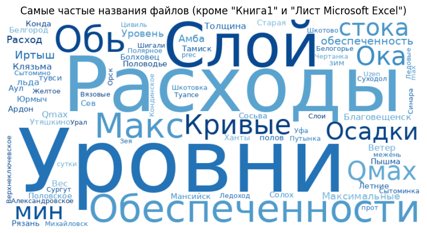
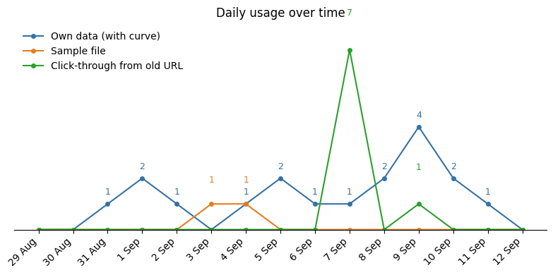
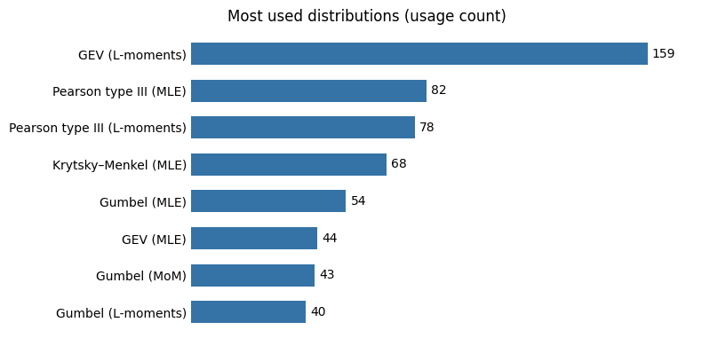
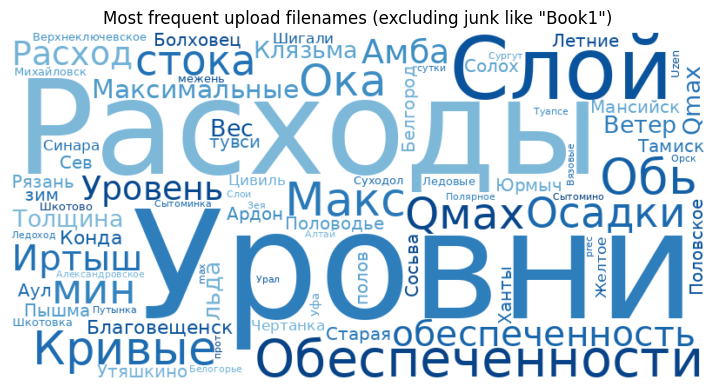

# Exceedance Curves

📉 Кривые обеспеченности / Exceedance curves

**[Русский](#-русский)** · **[English](#-english)**

---

## 🇷🇺 Русский

### О проекте

Streamlit-приложение для подбора теоретических распределений к гидрометеорологическим рядам и построения кривых обеспеченности.

Работа идёт по шагам: **загрузка → подготовка → обработка → результаты**. Есть тестовый Excel-пример.

### Основные функции

- **Загрузка Excel** и просмотр данных (есть тестовый файл)
- Подготовка ряда: группировка, агрегация, исключение точек, график хода значений
- Режимы кривых: обычная, усечённая, составная
- **Подбор распределений**: Гумбель, Пирсон III, GEV, Крицкого–Менкеля (ММП / моменты / L-моменты)
- График обеспеченности со шкалой периода повторяемости (годы)
- Таблицы квантилей и метрик качества (среднее, Cv, Cs, R², MAE, maxE, A–D); связанный ввод обеспеченности и периода повторяемости
- Интерфейс RU / EN
- **Выгрузка результатов в Word**

### Онлайн-доступ

Приложение на Streamlit Cloud:  
🔗 [https://exceedance-curves.streamlit.app/](https://exceedance-curves.streamlit.app/)

### Аналитика использования

Данные собираются, чтобы оценить пользу приложения и направления развития.

<!-- START_ANALYTICS -->

<!-- END_ANALYTICS -->

### Контакты

Вопросы и пожелания: [Telegram](https://t.me/ilia_kurdukov)

---

## 🇬🇧 English

### About

A Streamlit app for fitting theoretical distributions to hydrometeorological series and building exceedance curves.

Workflow: upload → prepare → process → results. A sample Excel file is available in the app.

### Main features

- **Excel upload** and data preview (sample file included)
- Series preparation: grouping, aggregation, point exclusion, time-series chart
- Curve modes: ordinary, truncated, and compound
- **Distributions fitting**: Gumbel, Pearson type III, GEV, Krytsky–Menkel (MLE / moments / L-moments)
- Exceedance plot with a return period axis (years)
- Quantile and goodness-of-fit tables (mean, Cv, Cs, R², MAE, maxE, A–D); linked exceedance ↔ return-period inputs
- RU / EN UI
- **Export results to a Word** document

### Online access

Live on Streamlit Cloud:  
🔗 [https://exceedance-curves.streamlit.app/](https://exceedance-curves.streamlit.app/)

### Usage analytics

Usage data is collected to assess the app’s value and guide further development.

<!-- START_ANALYTICS_EN -->

<!-- END_ANALYTICS_EN -->

### Contact

Questions and feedback: [Telegram](https://t.me/ilia_kurdukov)
