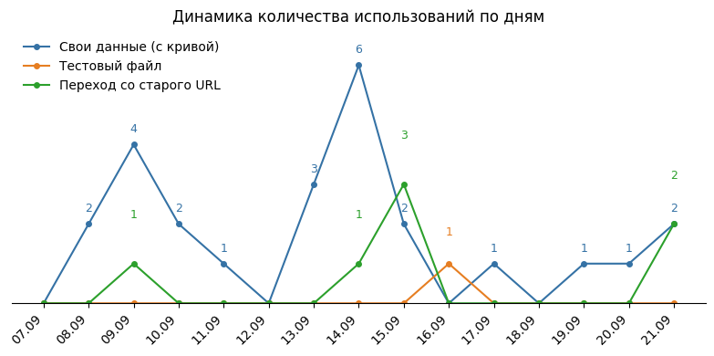
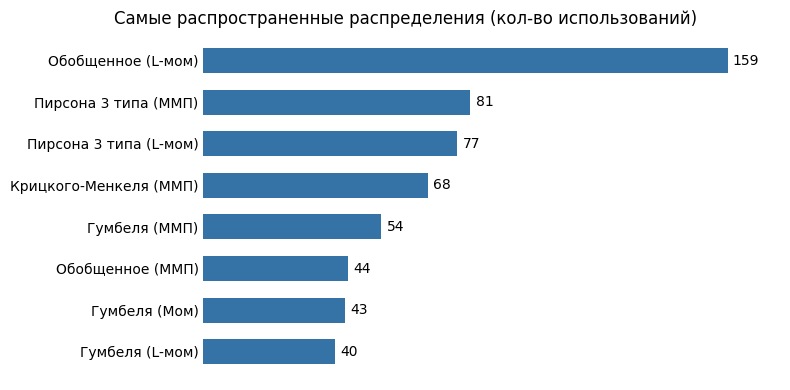

# The Security Curves  
📉 Построение кривых обеспеченности  

## 🚀 О проекте  
Приложение позволяет подобрать оптимальное теоретическое распределение для эмпирических данных и построить визуализацию.  

👉 **Основные функции:**  
- Построение эмпирического распределения
- Построение графика хода значений (динамика во времени)
- Подбор параметров распределения (Гумбеля/Крицкого-Менкеля/Пирсона 3 типа/Обобщенного экстремального)
- Визуализация подобранных распределений (кривые обеспеченности)
- Вывод таблицы со стандартными квантилями, расчет произвольных квантилей
- Вывод таблицы с параметрами подобранного распределения (Среднее, коэффициенты вариации и асимметрии) и метриками качества (R2, средняя и максимальная ошибки,  Критерий согласия Андерсона-Дарлинга)

🌐 **Онлайн-доступ**

Приложение развернуто в Streamlit Cloud:
🔗 [https://thesecuritycurves.streamlit.app/](https://thesecuritycurves-mk8pbyd72a3xukqdmtw4vb.streamlit.app/)

📂 **Структура проекта**

the_security_curves/  
├── .github/workflows/&nbsp;&nbsp;&nbsp;&nbsp;&nbsp;&nbsp;&nbsp;&nbsp;&nbsp;&nbsp;# Автоматизация GitHub Actions (обновление аналитики)  
├── scripts/&nbsp;&nbsp;&nbsp;&nbsp;&nbsp;&nbsp;&nbsp;&nbsp;&nbsp;&nbsp;&nbsp;&nbsp;&nbsp;&nbsp;&nbsp;&nbsp;&nbsp;&nbsp;&nbsp;&nbsp;# Вспомогательные скрипты  
│   └── update_analytics.py&nbsp;&nbsp;&nbsp;&nbsp;&nbsp;# Скрипт для генерации графиков и обновления README  
├── graphs/&nbsp;&nbsp;&nbsp;&nbsp;&nbsp;&nbsp;&nbsp;&nbsp;&nbsp;&nbsp;&nbsp;&nbsp;&nbsp;&nbsp;&nbsp;&nbsp;&nbsp;&nbsp;&nbsp;&nbsp;&nbsp;# Папка с генерируемыми графиками аналитики  
├── hidrodata.py&nbsp;&nbsp;&nbsp;&nbsp;&nbsp;&nbsp;&nbsp;&nbsp;&nbsp;&nbsp;&nbsp;&nbsp;&nbsp;&nbsp;&nbsp;&nbsp;# Главный скрипт приложения Streamlit  
├── analytics.csv&nbsp;&nbsp;&nbsp;&nbsp;&nbsp;&nbsp;&nbsp;&nbsp;&nbsp;&nbsp;&nbsp;&nbsp;&nbsp;&nbsp;&nbsp;# Логи использования приложения  
├── requirements.txt&nbsp;&nbsp;&nbsp;&nbsp;&nbsp;&nbsp;&nbsp;&nbsp;&nbsp;&nbsp;&nbsp;&nbsp;# Зависимости Python  
├── LICENSE&nbsp;&nbsp;&nbsp;&nbsp;&nbsp;&nbsp;&nbsp;&nbsp;&nbsp;&nbsp;&nbsp;&nbsp;&nbsp;&nbsp;&nbsp;&nbsp;&nbsp;&nbsp;&nbsp;&nbsp;&nbsp;# Лицензия  
└── README.md&nbsp;&nbsp;&nbsp;&nbsp;&nbsp;&nbsp;&nbsp;&nbsp;&nbsp;&nbsp;&nbsp;&nbsp;&nbsp;&nbsp;&nbsp;&nbsp;&nbsp;&nbsp;&nbsp;# Этот файл  

📊 **Аналитика использования приложения**

Данные собираются и анализируются для оценки пользы приложения, а также определения дальнейшего пути развития.
<!-- START_ANALYTICS -->

<!-- END_ANALYTICS -->

🔹 **Любые вопросы и пожелания:** [Телеграм](https://t.me/ilia_kurdukov)
